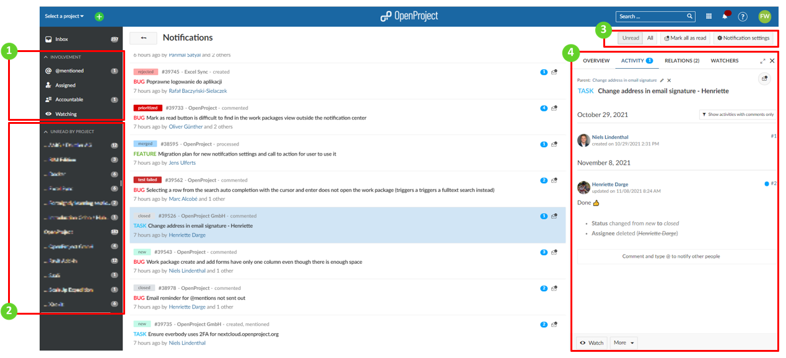

---
sidebar_navigation:
  title: Notifications
  priority: 590
description: In-app notifications in OpenProject
robots: index, follow
keywords: notifications
---
# In-app notifications

This section will introduce in-app notifications and explain how to work with them. 

## Overview of in-app notifications in OpenProject

In-app notifications are a tool to get notified about requests, changes and new assignments in OpenProject. The notifications can work as an alternative to email notification, or be used in parallel. This feature is enabled by default.

## Accessing in-app notifications

Whenever you are getting in-app notification, a red elliptical with the number of notifications is displayed on the bell symbol on the upper right side of the OpenProject screen between the module button and the help button. (Please note, if there are more than 99 notifications, the elliptical will simply be red without a number in it).

To view the notifications, please left-click on the bell symbol. By default, your notifications are sorted by work package. 

This will then take you to the **notification center**.

By default, messages are grouped by work package, and the number in the blue bubble next to each work package displays the number of related messages that are associated with each work package. Alternatively, these notifications can also be accessed from within a given work package under the "**Activity**" tab in the details view

To make viewing notifications more manageable, OpenProject includes several ways to filter or group notifications.

You can filter or group the notifications using the two areas in the left menu bar (1 and 2), or bulk edit notifications by selecting options in the top right (3) of the screen:

- **1**: You can filter by your **involvement**, for example filter for notifications that originated from mentions (@mentioned), from work packages you were assigned to or were accountable for or are simply watching.
- **2**: You can filter by **project**, for example filter for notifications that originated from a specific project.
- **3**: You can also filter notifications for "**Unread**" or "**All**" (Read and Unread) notifications, and "**Mark all as read**". Please note that the "**Mark all as read**" button only marks notifications that are currently in view. You may have to ultimately press "**Mark all as read**" multiple times to mark all of your notifications as read if you have a lot of them. The red elliptical will update the number of unread messages in real-time, and eventually disappear when there are no more unread notifications.
- **4:** When selecting any of the notifications, you can also view more **details in the split screen**, for example comments members made regarding a specific work package. Unread messages are indicated by a blue bubble.

In addition to the in-app notifications, you will also get a once-a-day summary of all notifications by email. To fine-tune Email Reminders, [click here](notification_settings/).

___

